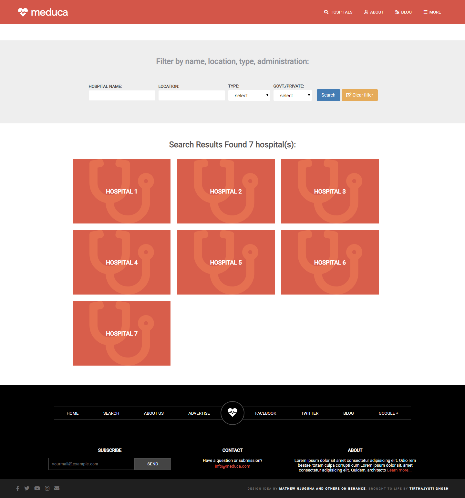
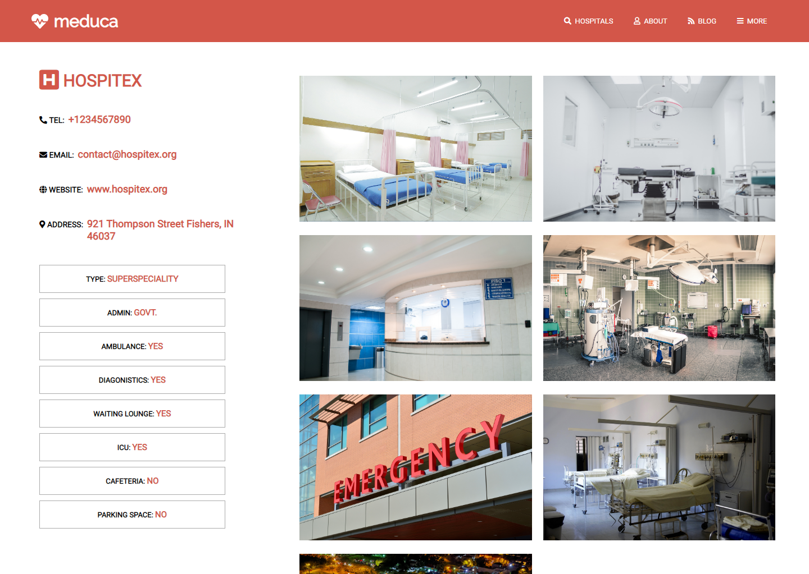

# Meduca - Search hospitals

Home page

Result page

Hospital page

# What it does

- List of hospitals
- index.html page contains a search form
- the search form button redirects to result.html, which shows a list of hospitals
- each block of a hospital redirects to hospital.html which contains detailed information about a hospital.
- design partially based on https://www.behance.net/gallery/25563385/PatashuleKE

# Features

- created a total of three pages (index.html, result.html, and hospital.html)
- using CSS Flexbox for the layout of the three pages
- using font-awesome for some icons
- using icons from flaticon
- responsive design for three different screen sizes (max 768, max 1024 and bigger screens)
- using Raleway and Roboto font (from google fonts)

## Built With

- HTML5
- CSS3
- font-awesome
- google fonts

#### and deployed to 000webhost

## Live Demo

[Live Demo](https://socialist-terms.000webhostapp.com/meduca/)

## Project Presentation

[Watch video](https://www.loom.com/share/558ccb0b622d4c60b8714163b64b0ea0)

## 🤝 Contributing

Contributions, issues and feature requests are welcome! Start by:

- Forking the project
- Cloning the project to your local machine
- `cd` into the project directory
- Run `git checkout -b your-branch-name`
- Make your contributions
- Push your branch up to your forked repository
- Open a Pull Request with a detailed description to the development branch of the original project for a review

## Attributions and Credit

- Special thanks to [Microverse](https://www.microverse.org/) for providing the learning oppurtunity.
- Original site design by [Mathew Njuguna and others on Behance](https://www.behance.net/mathewnjuguna)
- Icons made by [Freepik](https://www.flaticon.com/authors/freepik) and [srip](https://www.flaticon.com/authors/srip) from [Flaticons](https://www.flaticon.com/)
- Photos from [Jonathan Borba](https://www.pexels.com/@jonathanborba?utm_content=attributionCopyText&utm_medium=referral&utm_source=pexels) and [Tom Fisk](https://www.pexels.com/@tomfisk?utm_content=attributionCopyText&utm_medium=referral&utm_source=pexels) on [Pexels](https://www.pexels.com/photo/woman-giving-birth-3279204/?utm_content=attributionCopyText&utm_medium=referral&utm_source=pexels)
- Photos from [Waldemar Brandt](https://unsplash.com/@waldemarbrandt67w?utm_source=unsplash&utm_medium=referral&utm_content=creditCopyText), [Martha Dominguez de Gouveia](https://unsplash.com/@mdominguezfoto?utm_source=unsplash&utm_medium=referral&utm_content=creditCopyText), [Adhy Savala](https://unsplash.com/@adhy?utm_source=unsplash&utm_medium=referral&utm_content=creditCopyText), [pixpoetry](https://unsplash.com/@blackpoetry?utm_source=unsplash&utm_medium=referral&utm_content=creditCopyText) and [Arseny Togulev](https://unsplash.com/@tetrakiss?utm_source=unsplash&utm_medium=referral&utm_content=creditCopyText) on [Unsplash](https://unsplash.com/s/photos/pin-on-map?utm_source=unsplash&utm_medium=referral&utm_content=creditCopyText)

## Author

👤 **Tirthajyoti Ghosh**

- Github: [@tirthajyoti-ghosh](https://github.com/tirthajyoti-ghosh)
- Twitter: [@TirthajyotiGho1](https://twitter.com/TirthajyotiGho1)
- Linkedin: [tirthajyoti-ghosh](https://www.linkedin.com/in/tirthajyoti-ghosh-370544199/)

## Show your support

Give a ⭐️ if you like this project!

## 📝 License

Free

### Enjoy!
